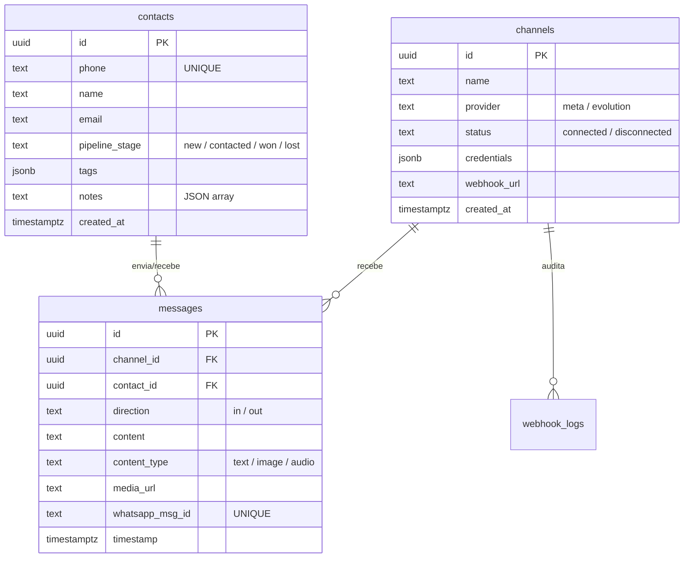

# Dossier Técnico – CRM Wiks (CRM Conversacional)

Este documento serve como a **especificação técnica definitiva** do projeto **CRM Wiks | CRM Conversacional**. Seu objetivo é fornecer contexto instantâneo e completo sobre a estrutura do site, funcionalidades, banco de dados, fluxos de integração e especificações técnicas.

---

## 1. Visão Geral do Projeto
O **CRM Wiks** é um CRM Conversacional moderno e de alta performance, desenhado para unificar atendimentos de clientes vindos de múltiplos canais (com foco em **WhatsApp**), permitindo a operadores humanos gerenciar conversas em tempo real, organizar leads em um funil de vendas (Kanban) e monitorar métricas comerciais por meio de um Dashboard analítico e automatizado.

---

## 2. Estrutura de Diretórios e Arquivos do Projeto

Abaixo está a árvore simplificada da estrutura do projeto:

```
crm_conversacional/
├── .agents/                    # Definições e habilidades do agente de IA
├── backend/                    # Scripts ou serviços auxiliares de back-end
├── docs/                       # Documentações adicionais
├── n8n-workflows/              # Arquivos JSON de exportação dos fluxos n8n
├── public/                     # Ativos estáticos públicos
├── src/                        # Código-fonte do Frontend (React)
│   ├── assets/                 # Imagens, logotipos e mídias do app
│   ├── components/             # Componentes de interface reutilizáveis
│   │   ├── ui/                 # Componentes genéricos de UI
│   │   ├── AiAgentSettings.jsx # Painel de configurações do Agente de IA
│   │   ├── AudioPlayer.jsx     # Player customizado para mensagens de áudio (.ogg / .mp3)
│   │   ├── ChannelsConfig.jsx  # Configuração e status dos canais ativos
│   │   ├── ChatWindow.jsx      # Janela principal de chat (tempo real)
│   │   ├── ContactsList.jsx    # Painel/Lista de gerenciamento de contatos
│   │   ├── Dashboard.jsx       # Métricas comerciais e gráficos
│   │   ├── FlowBuilder.jsx     # Interface de configuração de fluxo/agente
│   │   ├── KanbanBoard.jsx     # Funil de vendas no formato de painel Kanban
│   │   └── Sidebar.jsx         # Menu de navegação lateral
│   ├── context/
│   │   └── CrmContext.jsx      # Estado global e lógica de sincronização (Realtime + Polling)
│   ├── hooks/
│   │   └── useSupabase.js      # Hooks customizados para queries do Supabase
│   ├── lib/                    # Configurações de bibliotecas utilitárias
│   ├── services/
│   │   ├── n8nService.js       # Comunicação com os webhooks/API do n8n
│   │   └── supabaseService.js  # Serviços e consultas diretas ao Supabase
│   ├── styles/                 # Estilização CSS segregada por componente
│   │   ├── builder.css
│   │   ├── chat.css
│   │   ├── contacts.css
│   │   ├── dashboard.css
│   │   ├── kanban.css
│   │   ├── main.css
│   │   └── variables.css       # Variáveis de cores, temas e tipografia HSL
│   ├── App.css
│   ├── App.jsx                 # Componente raiz que gerencia a tela ativa
│   ├── index.css
│   ├── main.jsx                # Ponto de entrada do React
│   └── supabase.js             # Inicialização do cliente Supabase (JS SDK)
├── supabase/                   # Migrações, triggers e esquemas SQL
├── package.json                # Gerenciamento de dependências e scripts NPM
└── project_dossier.md          # Este documento de referência
```

---

## 3. Especificações Técnicas e Linguagens

- **Linguagem Principal:** JavaScript (ES6+, JSX)
- **Frontend Core:** React v19
- **Ferramenta de Build:** Vite v8
- **Estilização:** Vanilla CSS Moderno (usando Custom Properties baseadas em HSL no `variables.css` para temas Light/Dark dinâmicos e efeitos de glassmorphism) + Tailwind CSS v4.
- **Gráficos:** Recharts (usado no Dashboard para gráficos de rosca e barras).
- **Ícones:** Lucide React.
- **Banco de Dados (BaaS):** Supabase (PostgreSQL v15+)
- **Sincronização Realtime:** Supabase Realtime (WebSocket escutando `messages` e contatos).
- **Engine de Automação:** n8n (hospedado via Easypanel) para ingestão de webhooks e encaminhamento de saída.

---

## 4. Funcionalidades Principais

1. **Dashboard de Métricas:**
   - Exibição de cards com indicadores-chave de desempenho (conversões, leads ativos, tempo de resposta, etc.).
   - Gráficos interativos para visualizar a distribuição de leads no funil e volume de mensagens recebidas.
2. **Chat Centralizado (Tempo Real):**
   - Atendimento multi-canal com suporte a mensagens de texto, imagens e áudio.
   - Player de áudio integrado com controle de velocidade de reprodução (1x, 1.5x, 2x).
   - Indicação visual de status de entrega (`sending`, `sent`, `failed`).
   - Sincronização automática para manter a fila de chat em ordem cronológica de última mensagem (WhatsApp-like).
3. **Funil de Vendas Kanban:**
   - Visualização dos leads divididos por etapas (`Novo`, `Contatado`, `Proposta`, `Ganho`, `Perdido`).
   - Movimentação de leads entre colunas com salvamento automático de estado.
   - Indicação de valor financeiro estimado por oportunidade de negócio.
4. **Gerenciamento de Contatos:**
   - Lista completa de clientes com filtros por tags e pesquisa de nome/telefone.
   - Detalhes do contato contendo histórico de notas rápidas, e-mail, telefone e tags customizadas.
5. **Configuração de Canais:**
   - Conexão e desconexão de canais do **WhatsApp Meta Cloud API** e **Evolution API**.
   - Monitoramento visual de status (Conectado / Desconectado).
6. **Configurações do Agente de IA:**
   - Ativação ou pausa geral do bot de atendimento automático.
   - Configurações avançadas do comportamento do agente de IA.
   - Tag especial `"IA Inativa"` para pausar o robô automaticamente de forma individual para um lead assim que um operador humano envia uma mensagem manual.

---

## 5. Arquitetura de Dados (Schema Supabase)

O banco de dados é estruturado de forma relacional pura e otimizada para chat:



---

## 6. Fluxo de Realtime e Mecanismo de Sincronização

```
[Cliente WhatsApp] ──► [Meta/Evolution Webhook] ──► [n8n Webhook Trigger]
                                                          │
                                                    (Processa e Salva)
                                                          ▼
[CRM React App] ◄── [Supabase Realtime WebSocket] ◄── [Supabase DB]
```

1. **Inbound (Chegada):**
   - O cliente manda uma mensagem no WhatsApp.
   - O provedor dispara um webhook `POST` para o n8n.
   - O n8n faz a higienização do número de telefone e nome do perfil.
   - O n8n faz um **Upsert de Contato** no Supabase (`on_conflict=phone` para evitar duplicatas).
   - O n8n insere o registro da mensagem na tabela `messages`.
2. **Realtime Broadcast:**
   - A inserção da mensagem dispara um gatilho de replicação no PostgreSQL do Supabase.
   - O Supabase envia o evento via WebSocket para os clientes conectados.
   - O CRM (React) recebe o payload e atualiza o estado de `contacts` e `messages` em tempo real na tela, sem necessidade de recarregar a página.

---

## 7. Práticas Recomendadas e Solução de Problemas Comuns

> [!TIP]
> **1. Resiliência de Conflito de Chave Única (Constraint 409)**
> Na API REST do Supabase (PostgREST), para realizar upsert de contatos cuja chave única de negócio é o telefone (e não o UUID autogerado), é obrigatório utilizar o parâmetro query `?on_conflict=phone` nos nós do n8n. Sem ele, a reentrada de contatos existentes causará erro 409 e travará o fluxo de chat.
>
> **2. Resolução de Clock Skew (Atraso do Polling)**
> Em ambientes de produção, rely exclusivamente no Realtime do Supabase pode apresentar instabilidades temporárias de conexão WebSocket. Por isso, usamos uma estratégia híbrida de **Realtime + Polling Fallback (5s)**. 
> Para evitar perda de mensagens devido à diferença de clock entre a máquina do cliente e o servidor do Supabase, o polling nunca deve usar `new Date()` local, mas sim o timestamp `created_at` gerado estritamente pelo PostgreSQL na última consulta realizada.

---

## 8. Histórico de Alterações do Projeto

*(Toda alteração estrutural ou lógica feita pelo assistente deve ser anotada nesta seção)*

| Data | Tipo de Alteração | Descrição Detalhada | Arquivos Modificados |
| :--- | :--- | :--- | :--- |
| **19/06/2026** | **Documentação** | Criação do Dossier Técnico completo contendo estrutura de diretórios, arquitetura, stack e histórico de alterações. | [project_dossier.md](file:///C:/Users/CAIO/Desktop/Antigravityy/crm_conversacional/project_dossier.md) |
| **19/06/2026** | **Nova Funcionalidade** | Implementação completa do Módulo de Follow-Up Automático: tabelas `followup_rules` e `followup_queue`, componentes `FollowUpSettings.jsx` e `FollowUpRuleModal.jsx`, `followUpService.js`, workflow n8n `followup-dispatcher.json`, atualização do `CrmContext`, `Sidebar` e `App.jsx`, e estilos em `followup.css`. | [followup_module.sql](file:///C:/Users/CAIO/Desktop/Antigravityy/crm_conversacional/supabase/migrations/followup_module.sql), [FollowUpSettings.jsx](file:///C:/Users/CAIO/Desktop/Antigravityy/crm_conversacional/src/components/FollowUpSettings.jsx), [FollowUpRuleModal.jsx](file:///C:/Users/CAIO/Desktop/Antigravityy/crm_conversacional/src/components/FollowUpRuleModal.jsx), [followUpService.js](file:///C:/Users/CAIO/Desktop/Antigravityy/crm_conversacional/src/services/followUpService.js), [followup-dispatcher.json](file:///C:/Users/CAIO/Desktop/Antigravityy/crm_conversacional/n8n-workflows/followup-dispatcher.json), [CrmContext.jsx](file:///C:/Users/CAIO/Desktop/Antigravityy/crm_conversacional/src/context/CrmContext.jsx), [Sidebar.jsx](file:///C:/Users/CAIO/Desktop/Antigravityy/crm_conversacional/src/components/Sidebar.jsx), [App.jsx](file:///C:/Users/CAIO/Desktop/Antigravityy/crm_conversacional/src/App.jsx), [followup.css](file:///C:/Users/CAIO/Desktop/Antigravityy/crm_conversacional/src/styles/followup.css), [project_dossier.md](file:///C:/Users/CAIO/Desktop/Antigravityy/crm_conversacional/project_dossier.md) |
| **22/06/2026** | **Correção de Bug** | Correção de erro de sintaxe de UUID inválido no n8n. Atualização das expressões nos nós subsequentes aos de envio para lerem do nó `Substitute Variables` em vez de `$json` do nó de resposta de envio. | [followup-dispatcher.json](file:///C:/Users/CAIO/Desktop/Antigravityy/crm_conversacional/n8n-workflows/followup-dispatcher.json), [project_dossier.md](file:///C:/Users/CAIO/Desktop/Antigravityy/crm_conversacional/project_dossier.md) |
