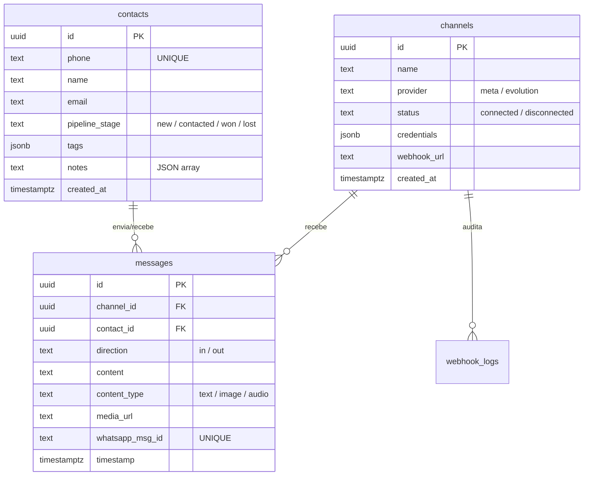

# Dossier Técnico – CRM Wiks (CRM Conversacional)

Este documento serve como a **especificação técnica definitiva** do projeto **CRM Wiks | CRM Conversacional**. Seu objetivo é fornecer contexto instantâneo e completo para outros assistentes de IA ou desenvolvedores parceiros que venham a colaborar no projeto.

---

## 1. Visão Geral do Projeto
O **CRM Wiks** é um CRM Conversacional moderno e de alta performance, desenhado para unificar atendimentos de clientes vindos de múltiplos canais (com foco em **WhatsApp**), permitindo a operadores humanos gerenciar conversas em tempo real, organizar leads em un funil de vendas (Kanban) e monitorar métricas comerciais por meio de um Dashboard analítico e automatizado.

---

## 2. Stack Tecnológica (Tech Stack)

### Frontend (Interface do Usuário)
- **Biblioteca Principal:** React v19
- **Ferramenta de Build:** Vite v8 (rápido e leve)
- **Roteamento:** React Router DOM v7
- **Estilização:** Tailwind CSS v4 + Vanilla CSS Custom Properties (para temas premium Light/Dark e glassmorfismo)
- **Ícones:** Lucide React
- **Gráficos:** Recharts (usado no Dashboard)

### Banco de Dados & Backend-as-a-Service (BaaS)
- **Banco de Dados:** Supabase (PostgreSQL v15+)
- **Sincronização Realtime:** Supabase Realtime (WebSocket do PostgreSQL `REPLICA IDENTITY FULL` para disparar eventos de `INSERT`/`UPDATE` no cliente instantaneamente)
- **Autenticação:** Anon Key (pública) para desenvolvimento ágil e Service Role Key (no back-end/n8n) para bypass de RLS (Row Level Security).

### Orquestração & Webhooks (Engine de Automação)
- **Ferramenta:** n8n (hospedado via Easypanel)
- **Fluxos Ativos:**
  1. **WhatsApp Meta Oficial (Inbound):** Recebe mensagens de webhook do WhatsApp Cloud API, faz o parse, cadastra o contato no Supabase e insere a mensagem.
  2. **WhatsApp Evolution API (Inbound):** Mesma lógica de recebimento, adaptada para a API não oficial via QR Code.
  3. **Outbound Router (Envio):** Captura eventos de novas mensagens do CRM, escolhe o provedor de destino (Meta ou Evolution) e faz o disparo da mensagem usando a API correta.

---

## 3. Arquitetura de Dados (Schema Supabase)

O banco de dados é estruturado de forma relacional pura e otimizada para chat:



---

## 4. Arquitetura de Realtime e Fluxo de Mensagens

O ciclo de vida de uma mensagem recebida funciona de forma assíncrona, robusta e tolerante a falhas:

```
[Cliente WhatsApp] ──► [Meta/Evolution Webhook] ──► [n8n Webhook Trigger]
                                                          │
                                                    (Processa e Salva)
                                                          ▼
[CRM React App] ◄── [Supabase Realtime WebSocket] ◄── [Supabase DB]
```

1. **Inbound (Chegada):**
   - O cliente manda uma mensagem no WhatsApp.
   - O provedor dispara um webhook `POST` para o n8n.
   - O n8n faz a higienização do número de telefone e nome do perfil.
   - O n8n faz um **Upsert de Contato** no Supabase (`on_conflict=phone` para evitar duplicatas).
   - O n8n insere o registro da mensagem na tabela `messages`.
2. **Realtime Broadcast:**
   - A inserção da mensagem dispara um gatilho de replicação no PostgreSQL do Supabase.
   - O Supabase envia o evento via WebSocket para os clientes conectados.
   - O CRM (React) recebe o payload e atualiza o estado de `contacts` e `messages` em tempo real na tela, sem necessidade de recarregar a página (F5).

---

## 5. Práticas e Desafios Resolvidos

> [!TIP]
> **1. Resiliência de Conflito de Chave Única (Constraint 409)**
> Na API REST do Supabase (PostgREST), para upsertar contatos cuja chave única de negócio é o telefone (e não o UUID autogerado), é obrigatório utilizar o parâmetro query `?on_conflict=phone` nos nós do n8n. Sem ele, a reentrada de contatos existentes causa erro 409 e trava o fluxo de chat.
>
> **2. Resolução de Clock Skew (Atraso do Polling)**
> Em ambientes de produção, rely exclusivamente no Realtime do Supabase pode apresentar instabilidades temporárias de conexão WebSocket. Por isso, usamos uma estratégia híbrida de **Realtime + Polling Fallback (5s)**. 
> Para evitar perda de mensagens devido à diferença de clock entre a máquina do cliente e o servidor do Supabase, o polling nunca deve usar `new Date()` local, mas sim o timestamp `created_at` gerado estritamente pelo PostgreSQL na última consulta realizada.
